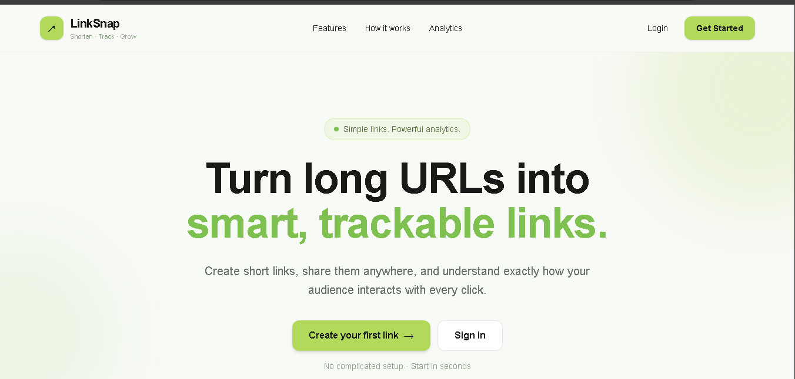
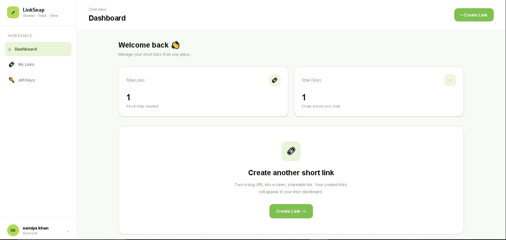
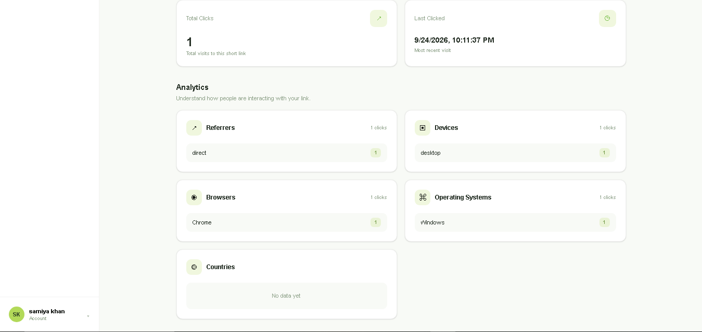

# 🔗 LinkSnap — Smart URL Shortener

> A production-style URL shortening and link management platform built with **Node.js, Express.js, MongoDB, Next.js, React, and Tailwind CSS**.

LinkSnap goes beyond basic URL shortening. It provides authenticated link management, analytics, search and filtering, API keys, usage controls, and a responsive dashboard for managing short links.

---

## 📸 UI Preview

### Landing Page



### Dashboard



### Link Analytics



---

## ✨ Features

### 🔗 URL Management

- Create short URLs
- Generate short codes
- Custom aliases
- Edit destination URLs
- Delete links
- Enable / disable links
- Link expiration support
- Destination history

### 📊 Analytics

- Total click tracking
- Last-click information
- Referrer breakdown
- Device breakdown
- Browser breakdown
- Operating-system breakdown
- Country breakdown

### 🔐 Authentication & Security

- User registration and login
- JWT-based authentication
- Password hashing with bcrypt
- Protected user routes
- API key creation and management
- API key revocation
- Rate limiting
- Plan-based usage quotas

### 🔎 Link Discovery

- Search links
- Filtering
- Pagination-ready API design
- User-specific link management

### 🖥️ Dashboard

- Responsive Next.js dashboard
- Dashboard overview
- My Links management
- Link detail and analytics view
- API Keys management
- Profile menu and logout
- Responsive UI for desktop and mobile

---

## 🛠️ Tech Stack

| Layer | Technology |
|---|---|
| Frontend | Next.js, React, Tailwind CSS |
| Backend | Node.js, Express.js |
| Database | MongoDB, Mongoose |
| Authentication | JWT, bcrypt |
| API Security | Rate Limiting, API Keys |
| Development | Docker, Git, GitHub |

---

## 🏗️ Architecture

```text
┌──────────────────────┐
│   Next.js Dashboard  │
│   React + Tailwind   │
└──────────┬───────────┘
           │
           │ REST API
           ▼
┌──────────────────────┐
│    Express.js API    │
│                      │
│ Auth • URLs •        │
│ Analytics • API Keys │
│ Validation • Security│
└──────────┬───────────┘
           │
           ▼
┌──────────────────────┐
│       MongoDB        │
│                      │
│ Users • URLs •       │
│ Clicks • API Keys    │
└──────────────────────┘
```

---

## 📁 Project Structure

```text
LinkSnap/
│
├── backend/
│   ├── src/
│   │   ├── config/
│   │   ├── controllers/
│   │   ├── middleware/
│   │   ├── models/
│   │   ├── routes/
│   │   ├── services/
│   │   └── utils/
│   ├── .env.example
│   └── package.json
│
├── frontend/
│   ├── src/
│   │   └── app/
│   └── package.json
│
├── docs/
│   ├── PRD
│   ├── TRD
│   ├── App Flow
│   ├── UI/UX Brief
│   ├── Backend Schema
│   └── Implementation Plan
│
├── screenshots/
│   ├── landing-page.png
│   ├── dashboard.png
│   └── analytics.png
│
├── docker-compose.yml
└── README.md
```

---

## 🚀 Quick Start

### 1. Start MongoDB and Redis

```bash
docker compose up -d
```

### 2. Start the Backend

```bash
cd backend
cp .env.example .env
npm install
npm run dev
```

### 3. Start the Frontend

Open another terminal:

```bash
cd frontend
npm install
npm run dev
```

The application will then be available through the local development servers.

---

## 📋 Project Progress

### Backend

- [x] Phase 0: Project setup
- [x] Phase 1: Express foundation + MongoDB
- [x] Phase 2: Login system
- [x] Phase 3: Core shortener — create, redirect, list, edit,delete   
- [x] Phase 4: Analytics, search, filters, destination history
- [x] Phase 5: Rate limiting, plan quotas, API keys, usage

### Frontend

- [x] Phase 6: Frontend UI + dashboard integration
- [x] Landing page
- [x] Login and registration
- [x] Dashboard
- [x] My Links
- [x] Link details and analytics
- [x] API Keys
- [x] Responsive UI
- [x] Profile menu and logout

---

## 🎯 What This Project Demonstrates

LinkSnap was built as a full-stack project to demonstrate practical experience with:

- REST API development
- Authentication and authorization
- MongoDB data modeling
- CRUD operations
- Analytics and aggregation
- API key management
- Rate limiting and usage controls
- Next.js application development
- React component-based UI
- Responsive dashboard design
- Frontend-to-backend API integration
- Git-based project development

---

## 📚 Project Documentation

Detailed planning and architecture documents are available in [`/docs`](./docs), including:

- Product Requirements Document (PRD)
- Technical Requirements Document (TRD)
- Application Flow
- UI/UX Design Brief
- Backend Schema
- Implementation Plan

---

## 🔮 Future Improvements

Potential future enhancements include:

- Redis-based short-link caching
- More advanced analytics visualizations
- API documentation with OpenAPI / Swagger
- Automated unit and integration tests
- Production monitoring and structured logging
- Additional performance and scaling improvements

---

## 👩‍💻 Author

**Samiya Khan**

Built as a full-stack project focused on backend engineering, API development, and modern web application development.