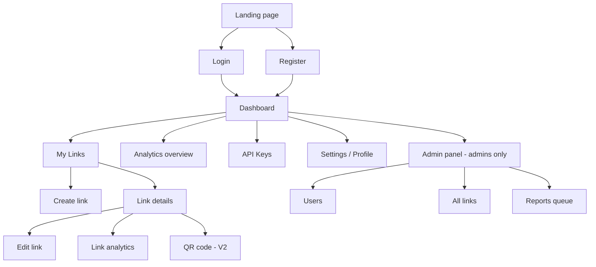
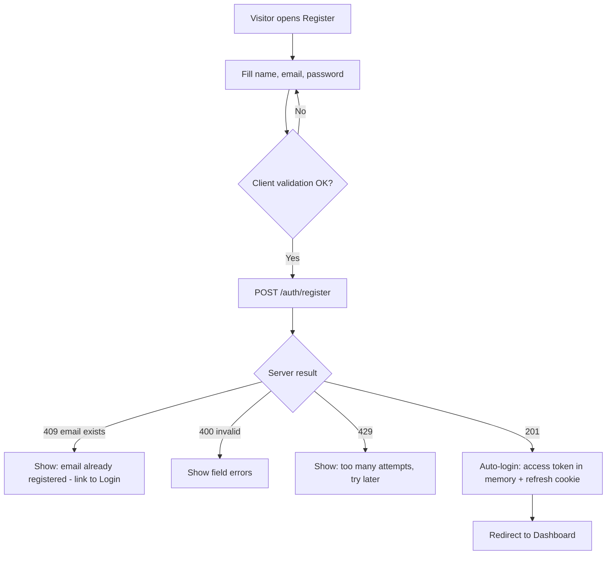
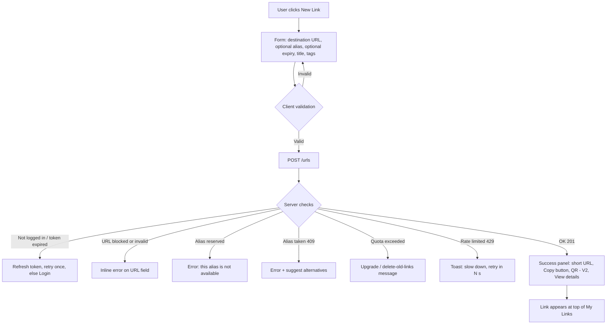
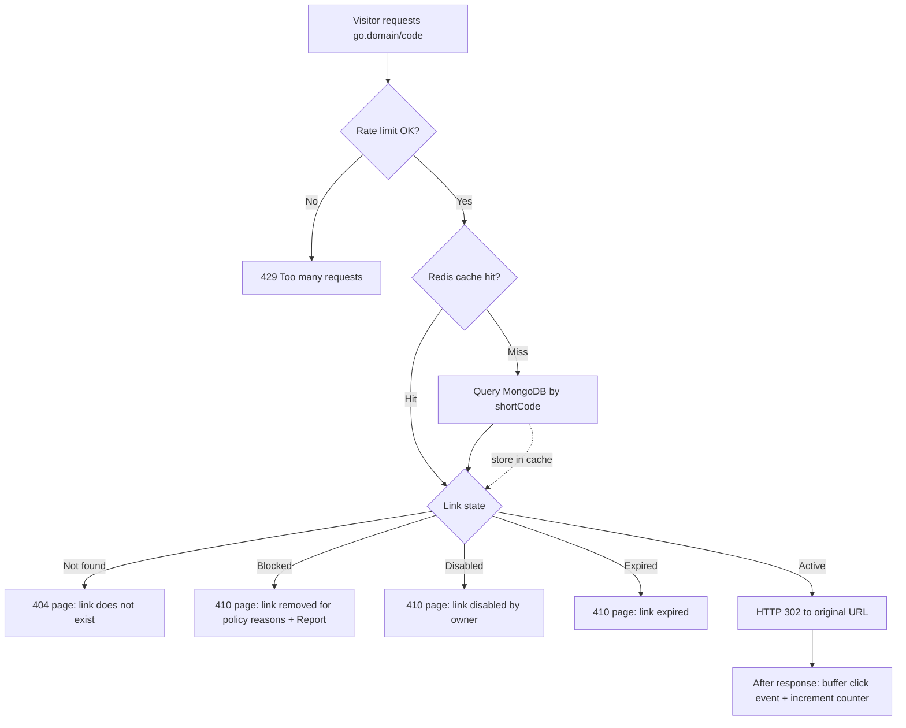
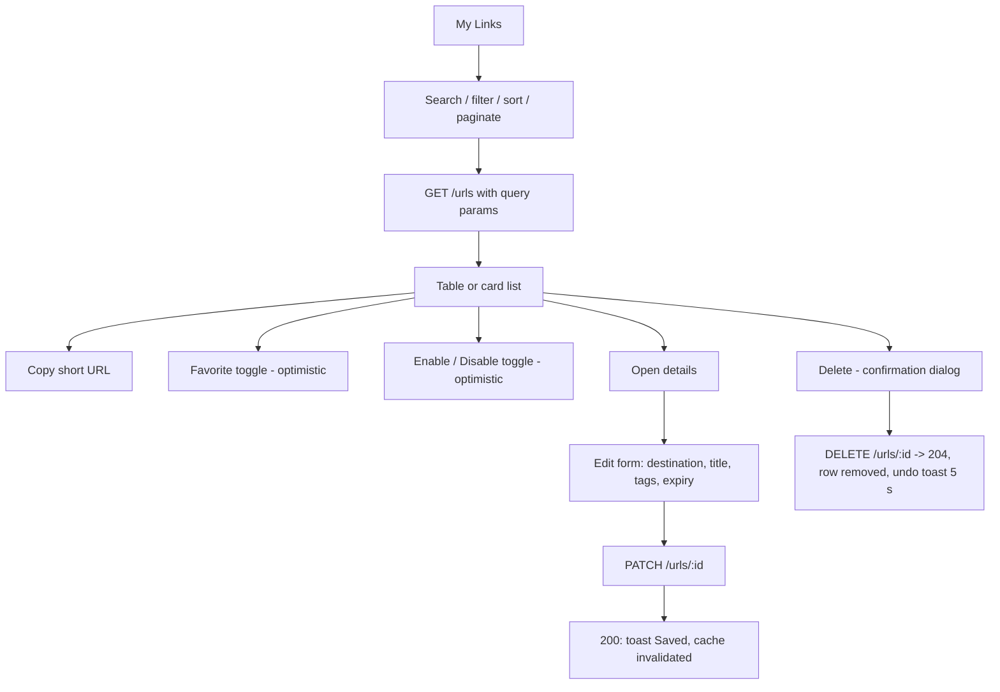
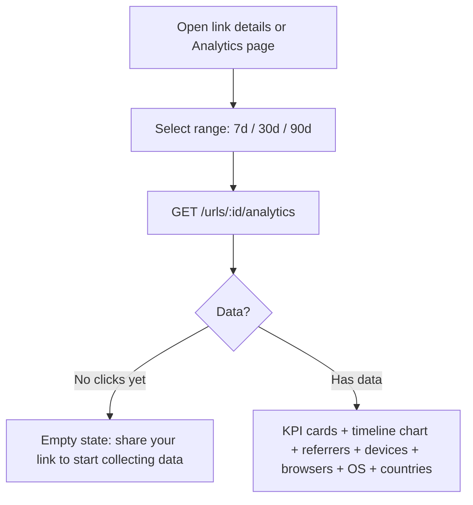
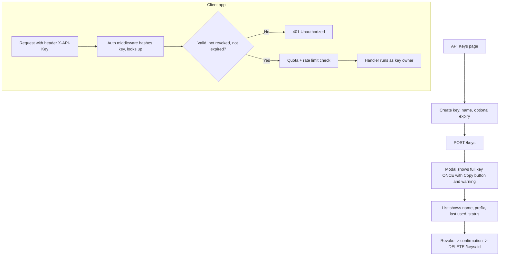
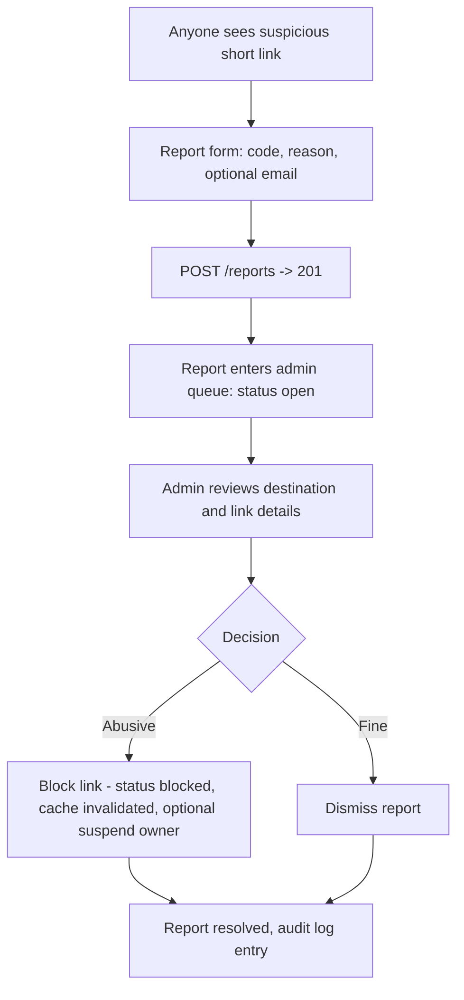
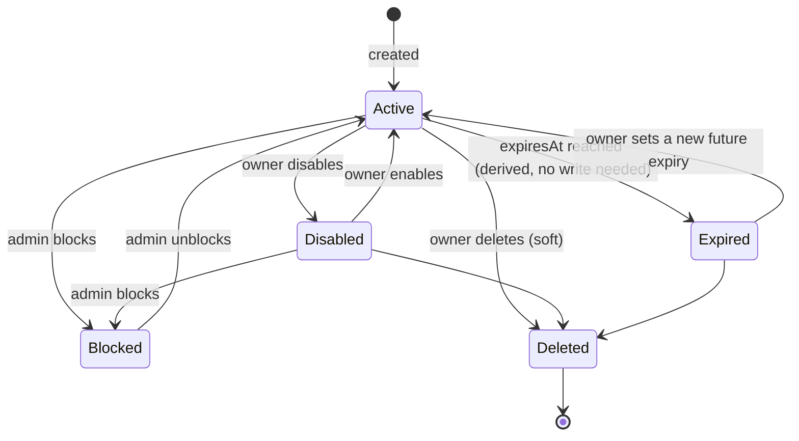

# App Flow Document
## Smart URL Shortener (Advanced)

Diagrams use [Mermaid](https://mermaid.js.org) (renders on GitHub, VS Code with a Mermaid extension, and most Markdown viewers).

---

## 1. Site Map & Navigation

**Public routes:** `/`, `/login`, `/register`, `/forgot-password`, `/terms`, `/privacy`
**Protected routes:** `/dashboard`, `/links`, `/links/new`, `/links/:id`, `/links/:id/edit`, `/analytics`, `/keys`, `/settings`
**Admin routes:** `/admin/users`, `/admin/links`, `/admin/reports`
**Short-domain routes (API server):** `/:code` (redirect), `/api/v1/...`

## 2. Flow: Registration & Login

Login: `POST /auth/login` → 200 → dashboard. 401 shows a generic "Email or password is incorrect" (never reveals which). Suspended users see "Account suspended, contact support."

**Session handling:** access token (15 min) is kept in memory. When an API call returns 401, the client silently calls `POST /auth/refresh`; if that fails, the user is sent to `/login?next=<current path>`. Logout calls `POST /auth/logout` and clears client state.

## 3. Flow: Create a Short Link

**Optional live alias check:** while typing an alias, the UI debounces (400 ms) and calls a lightweight availability check; the server still enforces uniqueness on submit.

## 4. Flow: Visitor Clicks a Short Link (Redirect)

Notes
- The redirect never requires login and never waits for analytics.
- Cache misses populate Redis; unknown codes are briefly negative-cached.
- Every error page has a "Report this link" and "Create your own short link" call to action.

## 5. Flow: Manage Links (List → Search → Edit → Disable/Delete)

Rules surfaced in the UI: alias and short code are read-only after creation; changing the destination shows a confirmation ("Existing short link will now go to the new URL") and is recorded in the audit log.

## 6. Flow: View Analytics

Dashboard home uses `GET /analytics/summary` for totals, active vs expired counts, clicks over time, and top links.

## 7. Flow: API Keys & Programmatic Use

## 8. Flow: Abuse Reporting & Admin Moderation

Blocked links show the policy-removal page to visitors; the owner sees a "Blocked by admin" badge and cannot re-enable it.

## 9. Flow: Link Lifecycle (state machine)

`Expired` is computed from `expiresAt` at read time, so there is nothing to update when a link expires. A nightly job only cleans up old data.

## 10. Flow: Admin Panel

1. Admin logs in (role `admin`) → sidebar shows **Admin**.
2. **Users:** search, view plan/status, suspend/reactivate, change plan.
3. **Links:** search by code/alias/domain/owner, block/unblock.
4. **Reports:** queue sorted by newest/open, resolve or dismiss.
5. Every admin action writes to `auditlogs`.

## 11. Error & Edge-Case Handling (global)

| Situation | User experience |
|---|---|
| Network failure | Toast "Can't reach the server" + retry button; forms keep their data |
| 401 during session | Silent refresh; if it fails, redirect to login with return path |
| 403 / not owner | Show "Not found" (does not reveal existence) |
| 404 route | Friendly 404 page with link home |
| 429 | Toast with countdown from `Retry-After` |
| 500 | Generic error with request ID for support |
| Redis down | Invisible to users; redirects fall back to MongoDB |
| Very long URL / unsupported scheme | Inline field error explaining accepted formats |
| Concurrent alias create | One succeeds, others get "alias taken" |

## 12. Page-Level Data Dependencies

| Page | API calls |
|---|---|
| Dashboard home | `/analytics/summary`, `/urls?limit=5&sort=createdAt` |
| My Links | `/urls` (query params) |
| Create / Edit | `POST /urls`, `PATCH /urls/:id` |
| Link details | `/urls/:id`, `/urls/:id/analytics` |
| API Keys | `/keys`, `/usage` |
| Settings | `/auth/me`, `PATCH /auth/me` |
| Admin | `/admin/users`, `/admin/urls`, `/admin/reports` |
